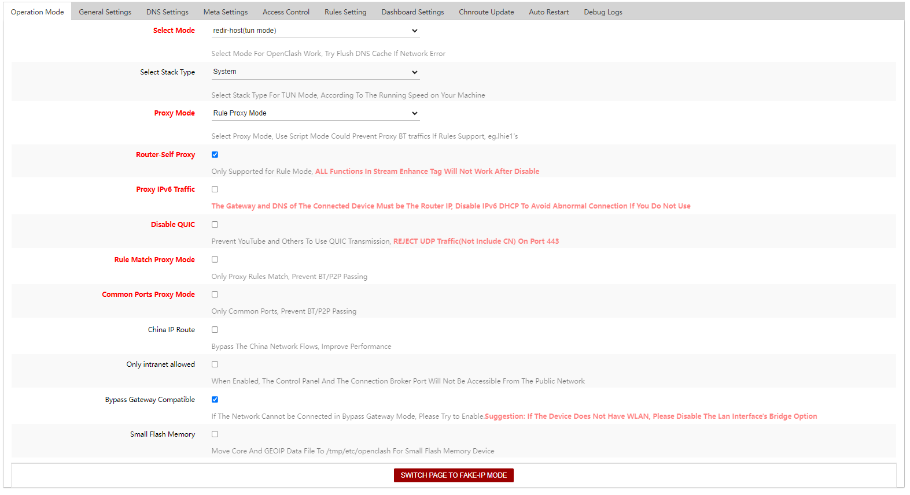
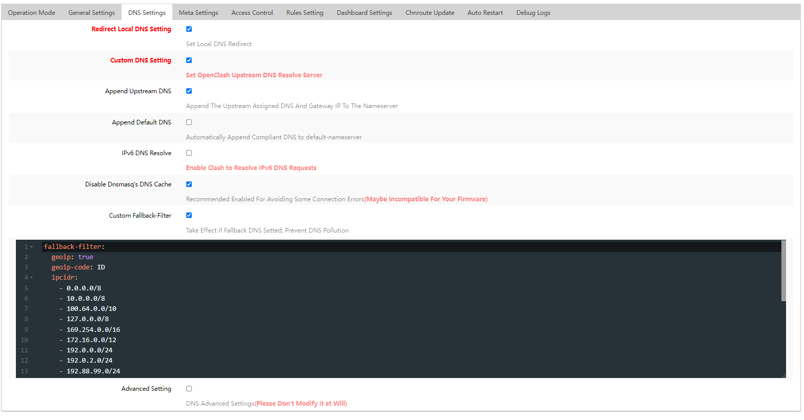
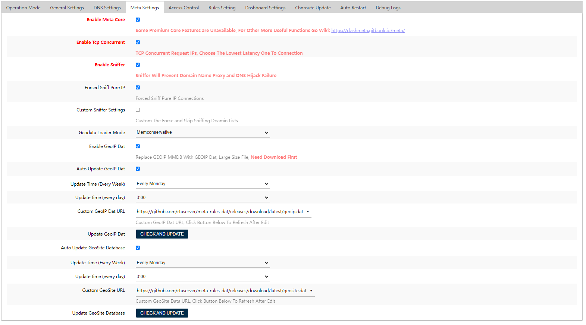
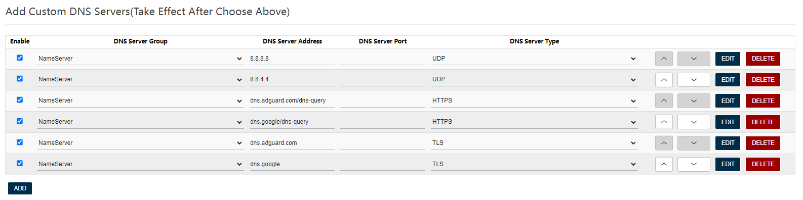

<h1 align="center">
  
  <br>Config OpenClash - Meta Kernel<br>
</h1>

<p align="center">
  <a href="https://github.com/rtaserver/Config-Open-ClashMeta/releases">
    
  </a>
  <a href="https://github.com/rtaserver/Config-Open-ClashMeta/blob/main/LICENSE">
   
  </a>
</p>

## Features

Easy Setup Headless multi session Whatsapp Gateway with NodeJS.

- Pisah Trafik Gaming Online
- Pisah Trafik Indo Only
- Adblock
- Support +2 Modem

<p>

<p align="center">
  <a href="https://github.com/rtaserver/Config-Open-ClashMeta/releases">
    <button type="button" name="myButton">Download Config</button>
  </a>
</p>

## Documentation

### Setting OpenClash 1



### Setting OpenClash 2



- Custom Fallback Filter

```
fallback-filter:
  geoip: true
  geoip-code: ID
  ipcidr:
    - 0.0.0.0/8
    - 10.0.0.0/8
    - 100.64.0.0/10
    - 127.0.0.0/8
    - 169.254.0.0/16
    - 172.16.0.0/12
    - 192.0.0.0/24
    - 192.0.2.0/24
    - 192.88.99.0/24
    - 192.168.0.0/16
    - 198.18.0.0/15
    - 198.51.100.0/24
    - 203.0.113.0/24
    - 224.0.0.0/4
    - 240.0.0.0/4
    - 255.255.255.255/32
  domain:
    - "+.google.com"
    - "+.facebook.com"
    - "+.youtube.com"
    - "+.githubusercontent.com"
    - "+.googlevideo.com"
    - "+.msftconnecttest.com"
    - "+.msftncsi.com"
    - msftconnecttest.com
    - msftncsi.com
```

### Setting OpenClash 3



- Setting Geodatabase
  - Country.mbb : https://github.com/rtaserver/meta-rules-dat/releases/download/latest/country.mmdb
  - Geoip.dat : https://github.com/rtaserver/meta-rules-dat/releases/download/latest/geoip.dat
  - Geosite.dat : https://github.com/rtaserver/meta-rules-dat/releases/download/latest/geosite.dat
#### JANGAN LUPA CHECK UPDATE UNTUK DOWNLOAD GEODATABASE

### Setting OpenClash 4



- Setting DNS / DNS Bebas

| DNS Server Group | DNS Server Address            | DNS Server Port | DNS Server Type |
| ---------------- | ----------------------------- | --------------- | --------------- |
| NameServer       | 8.8.8.8                       |                 | UDP             |
| NameServer       | 8.8.4.4                       |                 | UDP             |
| NameServer       | dns.adguard-dns.com/dns-query |                 | HTTPS           |
| NameServer       | dns.adguard-dns.com           |                 | TLS             |
