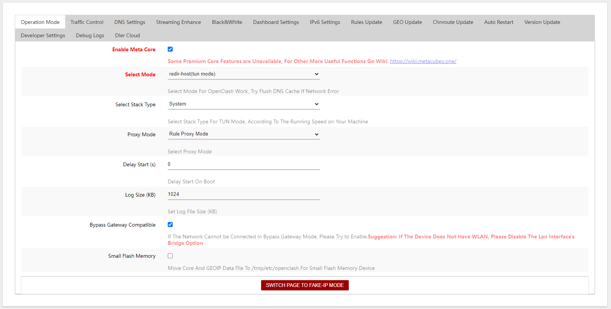
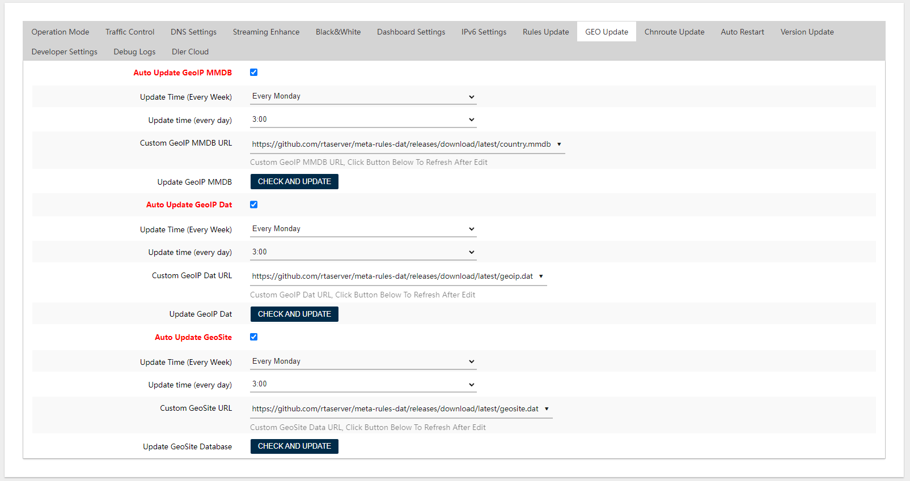
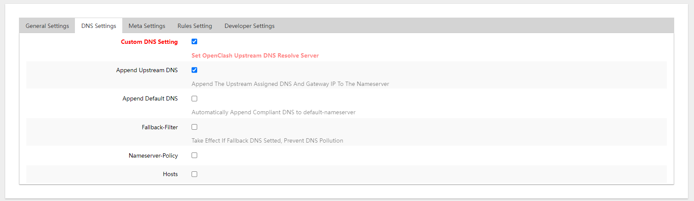
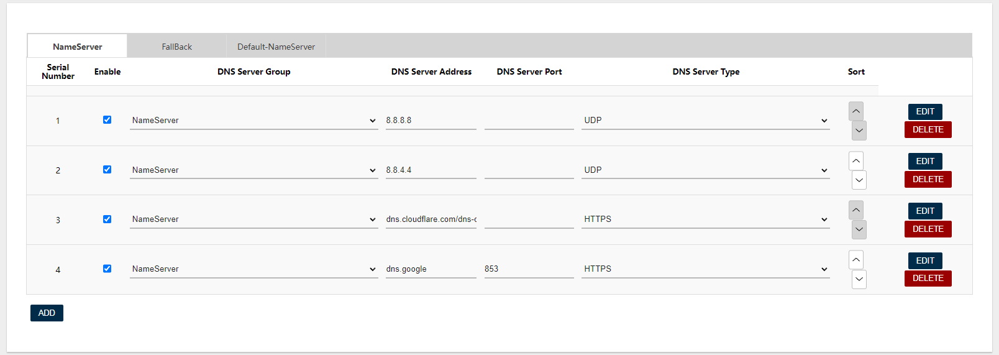
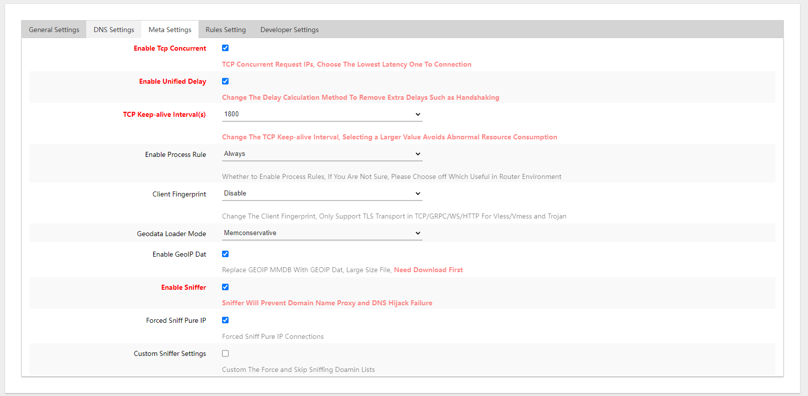
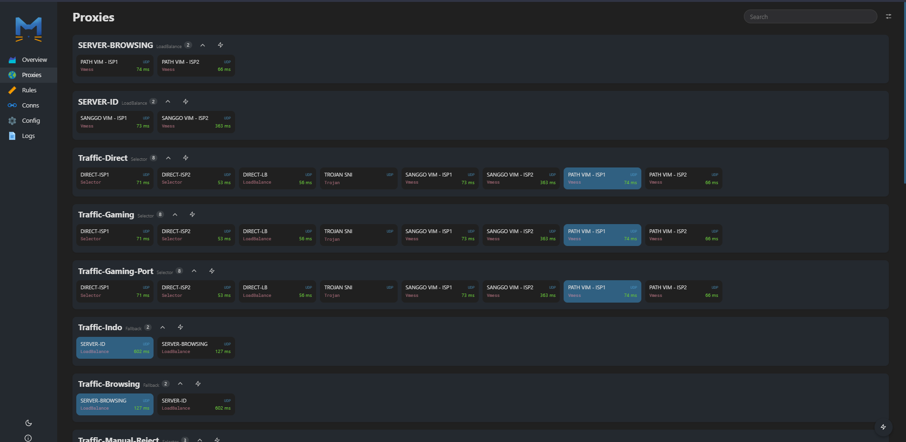
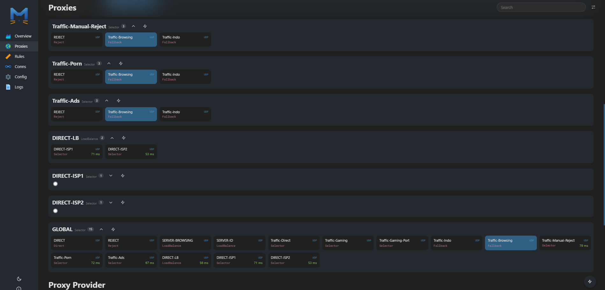

<h1 align="center">
  
   Config OpenClash - Meta Kernel 
</h1>

  
  

## Features

Simpel Config Pisah Traffic OpenClash Meta Version

- Pisah Trafik Gaming Online
- Pisah Trafik Indo Only
- Adblock
- Support +2 Modem

  <a href="https://github.com/rtaserver/Config-Open-ClashMeta/releases">
    <button type="button" name="myButton">Download Config</button>
  </a>

  <a href="https://github.com/rtaserver/OpenClash/tree/package/master">
    <button type="button" name="myButton">Download Latest OpenClash By RTA SERVER</button>
  </a>

## Documentation

### Overviews

### Setting Configuration

- Setting Geodatabase
  - Country.mbb : https://github.com/rtaserver/meta-rules-dat/releases/download/latest/country.mmdb
  - Geoip.dat : https://github.com/rtaserver/meta-rules-dat/releases/download/latest/geoip.dat
  - Geosite.dat : https://github.com/rtaserver/meta-rules-dat/releases/download/latest/geosite.dat
#### JANGAN LUPA KLIK CHECK AND UPDATE UNTUK DOWNLOAD GEODATABASE

- Setting DNS / DNS Bebas

| DNS Server Group | DNS Server Address            | DNS Server Port | DNS Server Type |
| ---------------- | ----------------------------- | --------------- | --------------- |
| NameServer       | 8.8.8.8                       |                 | UDP             |
| NameServer       | 8.8.4.4                       |                 | UDP             |
| NameServer       | dns.adguard-dns.com/dns-query |                 | HTTPS           |
| NameServer       | dns.adguard-dns.com           |                 | TLS             |

### Yacd Overviews Configuration

#### PADA BAGIAN PROXY GROUP GLOBAL PILIH `Traffic-Browsing`

---

