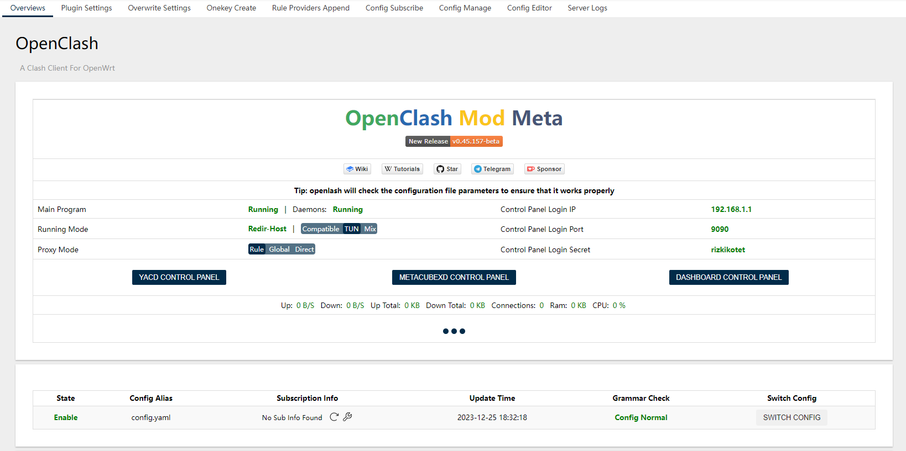
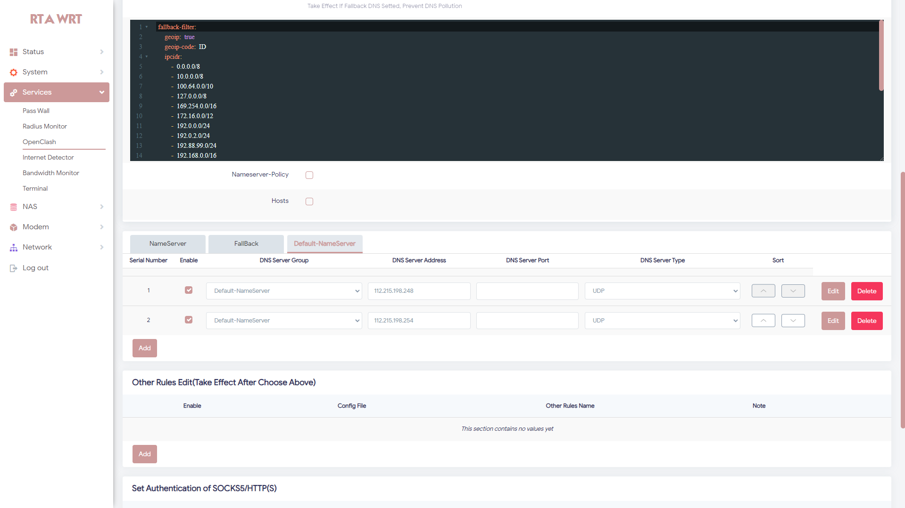
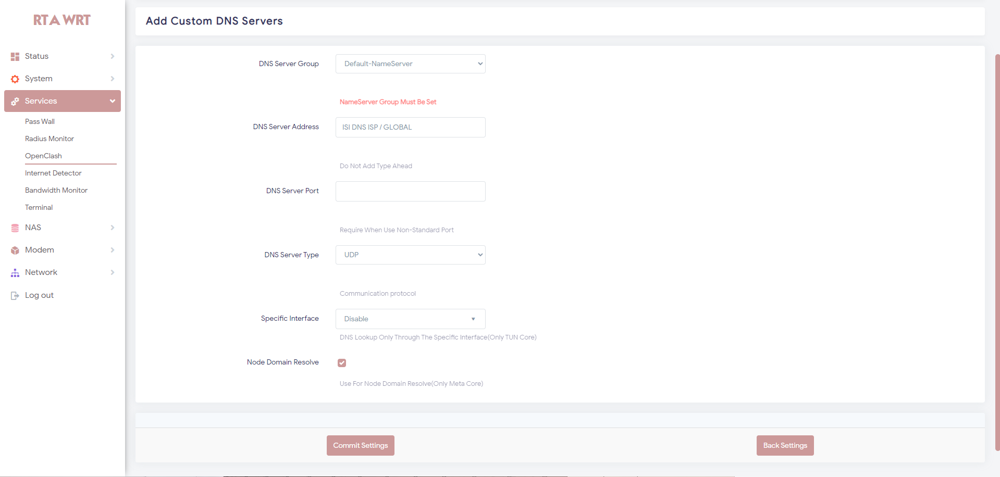
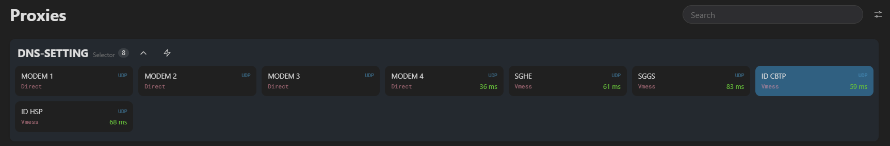
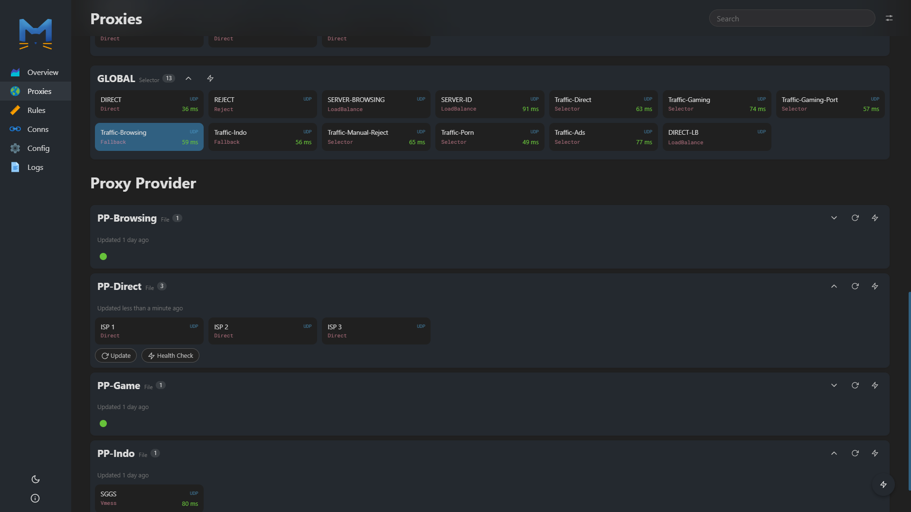

<h1 align="center">
  
  <br>Config OpenClash - Meta Kernel<br>
</h1>

<p align="center">
  <a href="https://github.com/rizkikotet-dev/Config-Open-ClashMeta/releases">
    
  </a>
  <a href="https://github.com/rizkikotet-dev/Config-Open-ClashMeta/blob/main/LICENSE">
   
  </a>
</p>

## Features

Simpel Config Pisah Traffic OpenClash Meta Version

- Fast Connect
- Anti Leaked
- Pisah Trafik Gaming Online
- Pisah Trafik Indo Only
- Adblock
- Support +2 Modem

<p>

<p align="center">
  <a href="https://github.com/rizkikotet-dev/Config-Open-ClashMeta/releases">
    <button type="button" name="myButton">Download Config</button>
  </a>
</p>

## Documentation

- For MihomoTProxy :

```bash
bash -c "$(wget -qO - 'https://github.com/rizkikotet-dev/OpenWrt-mihomo-Mod/raw/refs/heads/main/autoscript.sh')"
```

### Overviews



### Setting Configuration DNS

- NOTES : `DNS Provider Khusus Nol Kuota`
  - `112.215.198.248` : DNS XL
  - `112.215.198.254` : DNS XL
- Silahkan Ganti Dengan DNS Provider / DNS Global
- Contoh :
  - `1.1.1.1` : Cloudflare
  - `8.8.8.8` : Google
  - `9.9.9.9` : Quad9



- Jika Ingin Menambahkan DNS Baru



### Yacd Overviews Configuration

- Setting DNS Di Yacd
  - `Jika Dari ISP / MODEM` `DNS Leaked`. Tapi Fast Connect
  - `Jika Dari SERVER` `DNS Anti Leaked`. Tapi Butuh Beberapa Detik Baru Internet Jalan
- `NOTES` : Leaked Di Atas Tergantung Saat Pengisian DNS Di `Default-NameServer`
  - Silahkan Cek Di Atas Fungsinya



- Setting Global Proxy
  - `Traffic-Browsing`



---
